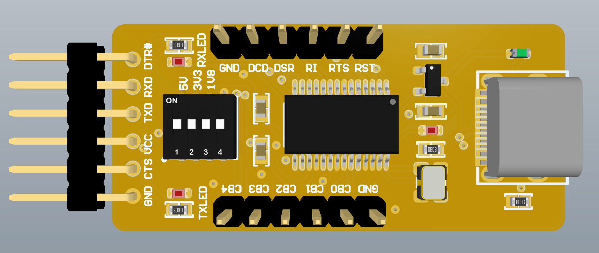

# FT232RL Model
## 🎨效果图

## ✈关于外置晶振
FT232R默认使用内置振荡器，若要使用外部晶振需要使用FT_Prog软件修改EEPROM：
- 找到`Hardware Specific -> ExternalOscillator`勾选`Use External Oscillator`
- 写入EEPROM

### ⚠注意⚠
**如果没有晶振勾选了此项，就会导致芯片无法启动！**

## 📃Note

- **尚未打板验证**
